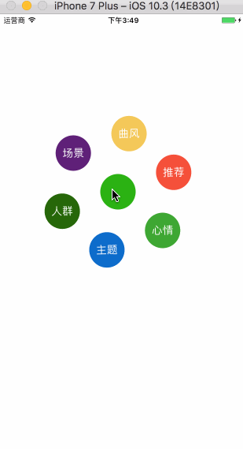

# ZCCircleView
A custom animation

### How to use

```objc

ZCCircleView *circleView = [[ZCCircleView alloc] initWithCenterPoint:CGPointMake(200, 300) radius:100 childCilcleRadius:30 number:6 circleButtonClick:^(UIButton *button) {
label.text = [NSString stringWithFormat:@"%zd.%@",button.tag,button.titleLabel.text];
} animationDuration:1 rotation:YES];
circleView.titleArray = @[@"主题",@"心情",@"推荐",@"曲风",@"场景",@"人群"];
[self.view addSubview:circleView];

```

